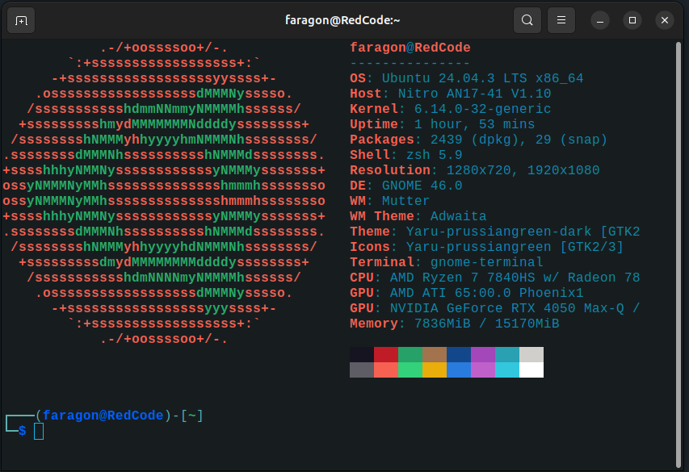

# Guía para personalizar la terminal🐧

## Descripción:
Esta es una pequeña guía para personalizar **visual** y **funcionalmente** la terminal. Utilizaremos:
- **Neofetch** → Mostrar información del sistema con estilo.
- **Oh My Zsh** → Framework para administrar configuraciones, temas y plugins de **Zsh**.

> Aunque la guía está pensada principalmente para **Bash/Zsh en Linux**, con algunos cambios puede aplicarse también en **CMD/PowerShell de Windows** (próximamente se actualizará para ese útil pero deplorable sistema).

El objetivo es lograr que la terminal se vea así:

Además, configuraremos plugins que mejoran la navegación y la productividad.

---

## Requisitos:
- Sistema operativo compatible
- Terminal compatible
- Conexión a internet
- ☕ Café (no es obligatorio, pero sí muy recomendable)
- Verificar tener **curl** y **nano** instalados
```bash
nano --version
curl --version
```

## Instalar curl y nano
```bash
sudo apt install curl
sudo apt install nano
# Extra divertido:
curl parrot.live
```

---

## Pasos de instalación y configuración de tema

### 1. Actualizar el sistema
```bash
sudo apt update
sudo apt upgrade -y
```

### 2. Instalar Zsh
```bash
sudo apt install zsh -y
```
#### Verificar la instalación
```bash
zsh --version
```

### 3. Establecer Zsh como tu shell predeterminado
```bash
chsh -s $(which zsh)
```
> Reiniciar la terminal para aplicar los cambios.

### 4. Instalar Oh My Zsh
```bash
sh -c "$(curl -fsSL https://raw.githubusercontent.com/ohmyzsh/ohmyzsh/master/tools/install.sh)"
```
> Si no te deja, instala primero **curl**.

### 5. Instalar NeoFetch
```bash
sudo apt install neofetch -y
```
Probar ejecución:
```bash
neofetch
```

### 6. Configura NeoFetch para que se ejecute al iniciar la terminal
Editar el archivo `~/.zshrc` con:
```bash
nano ~/.zshrc
```
Y agregar al final:
```bash
neofetch
```

### 7. Elegir un tema para Zsh
Oh My Zsh incluye varios temas. Para cambiarlo:
1. Editar `~/.zshrc`
2. Buscar la variable:
```bash
ZSH_THEME="robbyrussell"
```
3. Reemplazar por otro, por ejemplo:
```bash
ZSH_THEME="agnoster"
```

#### Tema estilo Kali Linux (el de la captura)
Puedes instalar **Powerlevel10k**, que replica el estilo de Kali:
```bash
git clone --depth=1 https://github.com/romkatv/powerlevel10k.git ${ZSH_CUSTOM:-$HOME/.oh-my-zsh/custom}/themes/powerlevel10k
```
Editar `~/.zshrc` y cambiar:
```bash
ZSH_THEME="powerlevel10k/powerlevel10k"
```
Pero el yo uso **kali-like** que es el que aparece en la foto
```bash
wget -O ~/.oh-my-zsh/themes/kali-like.zsh-theme https://raw.githubusercontent.com/clamy54/kali-like-zsh-theme/master/kali-like.zsh-theme
```
Editar `~/.zshrc` y cambiar:
```bash
ZSH_THEME="kali-like"
```

> Para que se vea como en la captura, recomiendo también probar el tema **kali-like**, ya que muestra tanto tu ubicación en los ficheros como la rama actual del repositorio.

---

## Instalación y configuración de plugins
A continuación, se explica cómo instalar y configurar los plugins más útiles, incluyendo los que tienes en tu `~/.zshrc`. Recuerda que el comando para entrar es:
```bash
nano ~/.zshrc
```

### Plugins básicos desde tu configuración:
```bash
plugins=(git z sudo zsh-autosuggestions zsh-syntax-highlighting colored-man-pages)
```

#### Instalación de cada uno:
- **zsh-autosuggestions**:
```bash
git clone https://github.com/zsh-users/zsh-autosuggestions ${ZSH_CUSTOM:-~/.oh-my-zsh/custom}/plugins/zsh-autosuggestions
```
- **zsh-syntax-highlighting**:
```bash
git clone https://github.com/zsh-users/zsh-syntax-highlighting.git ${ZSH_CUSTOM:-~/.oh-my-zsh/custom}/plugins/zsh-syntax-highlighting
```
- **zoxide** (versión moderna de `z`):
```bash
sudo apt install zoxide -y
```

### Inicializar zoxide
Debajo de la línea de plugins en tu `~/.zshrc`, agrega:
```bash
eval "$(zoxide init zsh)"
```
Esto habilita la navegación rápida por directorios usando:
```bash
z <nombre_parcial_directorio>
```

### Alias de ejemplo:
```bash
# Ejemplos
alias zshconfig="nano ~/.zshrc"
alias ohmyzsh="nano ~/.oh-my-zsh"
```

---

## 🎨 Resultado final esperado
Una terminal con:
- **Neofetch** mostrando información del sistema y un logo ASCII (próximamente se actualizará la guía para personalizarlo y crear el tuyo propio).
- **Zsh** con un tema elegante (Powerlevel10k o kali-like).
- **Plugins** que hacen la navegación más rápida y eficiente.

### Top 30 mejores plugins
#### Productividad y navegación
- git → Atajos poderosos para trabajar con Git.
- z → Navegación rápida por directorios visitados.
- autojump → Similar a z, pero más avanzado.
- zoxide → Versión moderna y veloz de z.
- extract → Descomprime cualquier archivo con un solo comando.
- colored-man-pages → Manuales con colores para leer sin llorar.
- aliases → Muestra y gestiona los alias fácilmente.
- sudo → Permite anteponer sudo rápidamente al último comando.
- history-substring-search → Busca en tu historial por coincidencias.
- dirhistory → Usa las teclas de dirección para moverte entre directorios.

#### Apariencia y estilo
- zsh-autosuggestions → Sugerencias en tiempo real mientras escribes.
- zsh-syntax-highlighting → Resalta errores y comandos válidos en colores.
- fast-syntax-highlighting → Una versión aún más rápida de lo anterior.
- vi-mode → Permite usar atajos de vim en la terminal.
- fzf → Integración con el buscador interactivo FZF.
- safe-paste → Evita ejecuciones accidentales al pegar comandos.

#### Integraciones con servicios
- docker → Alias y helpers para Docker.
- docker-compose → Atajos para docker-compose.
- kubectl → Soporte para Kubernetes.
- aws → Helpers para AWS CLI.
- npm → Alias útiles para Node y npm.
- pip → Para Python y gestión de paquetes.
- pyenv → Integración con pyenv.
- nvm → Integración con Node Version Manager.
- golang → Helpers para trabajar con Go.
- git-extras → Aumenta las funcionalidades del plugin git.

#### Extras útiles
- encode64 → Codifica y decodifica en base64.
- urltools → Juega con URLs desde la terminal.
- web-search → Busca en Google, Bing o DuckDuckGo desde la terminal.

---

## 🐧Notas finales
- Puedes personalizar Neofetch editando el archivo: `~/.config/neofetch/config.conf`.
- La elección de tema depende de tu gusto. **Powerlevel10k** es el más completo, pero personalmente me gusta **kali-like** por estética y porque muestra tanto tu ubicación en los ficheros como la rama actual del repositorio.
- Recuerda: la terminal es como un traje de Iron Man: potente, elegante y hecha a tu medida.
- Ten en cuenta que Linux es el sistema de la **libertad**. No te limites a esta guía: este es un buen punto de partida para seguir explorando y jugando con el sistema. El maravilloso mundo de Linux y la terminal está lleno de documentación y de proyectos muy locos.


---
Aquí termina la guía, pero no el viaje.
La terminal no es un límite, es un universo.
Explora, rompe, reconstruye. Y nunca olvides: el buen café y el buen código siempre saben mejor juntos.


— Faragon ☕


---
“Si no puedes hacer grandes cosas, haz pequeñas cosas de manera espectacular.”
— Jarvis, asistente de Faragon.