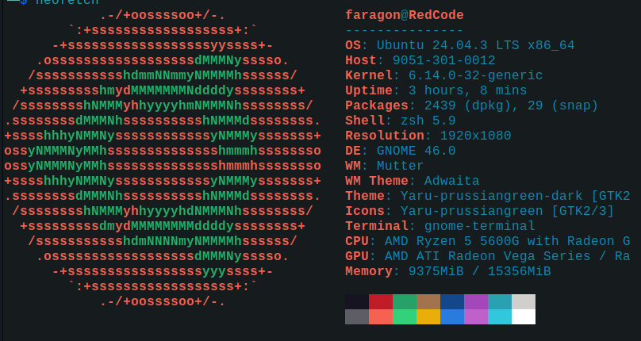

# Guía para personalizar la terminal🐧

## Descripción:
Esta es una pequeña guía para personalizar **visual** y **funcionalmente** la terminal. Utilizaremos:
- **Neofetch** → Mostrar información del sistema con estilo.
- **Oh My Zsh** → Framework para administrar configuraciones, temas y plugins de **Zsh**.

El objetivo es lograr que la terminal se vea así:


Además, configuraremos plugins que mejoran la navegación, la productividad y una lista de los 30 mejores segun J.A.R.V.I.S
> Aunque la guía está para **Bash/Zsh en Linux**, con algunos cambios puede aplicarse también en **CMD/PowerShell de Windows** (próximamente subire la guia para windows para que los pobres usuarios de **Windows** tengan una terminal que no sea una basura).

---

## Requisitos:
- Sistema operativo compatible
- Terminal compatible
- Conexión a internet
- ☕ Café (no es obligatorio, pero sí muy recomendable)
- Verificar tener **curl** y **nano** instalados
```bash
nano --version
curl --version
```


## Instalar curl y nano (si no los tienes)
```bash
sudo apt install curl
sudo apt install nano
# Extra divertido:
curl parrot.live
```

---


## Pasos de instalación y configuración de tema

### 1. Actualizar el sistema
```bash
sudo apt update
sudo apt upgrade -y
```


### 2. Instalar Zsh y verificar la version
Las versiones mas estables y con mayor soporte son de la 5.0 en adelante
```bash
sudo apt install zsh -y
zsh --version
```


### 3. Instalar NeoFetch
```bash
sudo apt install neofetch -y
#Probar la ejecución:
neofetch
```
Cuando se pruebe la ejecucion debe verse la termnial asi:

si tu terminal no se ve asi pudo haberse dado un error en la instalacion de paquetes,
desinstala NeoFetch
```bash
sudo apt remove neofetch -y
```
y vuelve a instalarlo


### 4. Instalar Oh My Zsh (framework de configuracion para zsh)
```bash
sh -c "$(curl -fsSL https://raw.githubusercontent.com/ohmyzsh/ohmyzsh/master/tools/install.sh)"
```
> Si no te deja recuerda que debes tener instalado **curl**.


### 5. Establecer Zsh como tu shell predeterminado
```bash
chsh -s $(which zsh)
```
Depues de esto hay que reiniciar la terminal cerrandola y habriendola o con este comando
```bash
source ~/.zshrc
#En algunos casos no basta con reiniciar la terminal y hay que reiniciar el PC:
sudo reboot
```


### 6. Configura NeoFetch para que se ejecute al iniciar la terminal
Entra al archivo `~/.zshrc` con:
```bash
nano ~/.zshrc
```
Agrega al final del archivo este comando y aun no cierres el archivo
```bash
neofetch
```
El comando `~/.zshrc` se va a seguir usando entoces vamos a crear un alias para facilitarnos la vida, al final del archivo debajo de `neofetch` copia y pega ambas lineas la segunda es para facilitar el reinicio de la terminal:
```
# alias zshconfig="nano ~/.zshrc"
# alias bashreboot="source ~/.zshrc
```
guarda los cambios y reinicia la terminal (los alias no funciona sin reiniciar la terminal)


### 7. Instalar temas externos
##### Este paso es obsional, si no te interesa cambiar de tema saltatelo
Estos temas son dos buenas opciones para que la terminal tenga la apariencia de la terminal de Kali Linux.
Este comando instala **Powerlevel10k**. Un tema muy completo
```bash
git clone --depth=1 https://github.com/romkatv/powerlevel10k.git ${ZSH_CUSTOM:-$HOME/.oh-my-zsh/custom}/themes/powerlevel10k
```
O puedes instalar el tema que yo uso (el de la foto) **kali-like**:
```bash
wget -O ~/.oh-my-zsh/themes/kali-like.zsh-theme https://raw.githubusercontent.com/clamy54/kali-like-zsh-theme/master/kali-like.zsh-theme
```
>Estos no son los unicos temas solo son mis favoritos


### 8. Configurar el tema:
Oh My Zsh incluye varios temas. Para cambiarlos:
1. Entra a `~/.zshtc` o si configuraste el alias: `zshconfig`
2. Buscar la variable `ZSH_THEME="robbyrussell"` (suele estar arriba)
3. Reemplazar por otro, cualquiera de estos por ejemplo:
```bash
#Uno de los temas incluidos
ZSH_THEME="agnoster"

#Este es muy bonito pero requiere de una pequeña configuracion
ZSH_THEME="powerlevel10k/powerlevel10k"

#El tema de Kali Linux
ZSH_THEME="kali-like"
```
Recuerda reiniciar la terminal


---


## Instalación y configuración de plugins
A continuación, se explica cómo instalar y configurar unos plugins basicos pero muy utiles, hay muchos mas pero estos son que yo uso a diario algunos ya vienen instalados y otros hay que instalarlos.

### Instalar los plugins externos:
- **zsh-autosuggestions**:
```bash
git clone https://github.com/zsh-users/zsh-autosuggestions ${ZSH_CUSTOM:-~/.oh-my-zsh/custom}/plugins/zsh-autosuggestions
```
- **zsh-syntax-highlighting**:
```bash
git clone https://github.com/zsh-users/zsh-syntax-highlighting.git ${ZSH_CUSTOM:-~/.oh-my-zsh/custom}/plugins/zsh-syntax-highlighting
```
- **zoxide** (versión moderna de `z`)
```bash
sudo apt install zoxide -y
```


### Aplicar los plugins:
En el archivo `~/.zshrc` busca la variable **plugins** y asugurara de poner todos los plugins que deseas usar:
```bash
plugins=(git sudo zsh-autosuggestions zsh-syntax-highlighting colored-man-pages)
```


#### zoxide;
Zoxide no funciona agragandolo en lavariable **plugins** asi que debajo de la línea de plugins en tu `~/.zshrc`, agrega:
```bash
eval "$(zoxide init zsh)"
```


### Como y para que se usan estos plugins:
1. **zsh-autosuggestions**:
Te sugiere automáticamente comandos mientras escribes en la terminal, basándose en tu historial.
Por ejemplo, si escribes `gi` y ya habías usado antes `git status`, la terminal te mostrará `git status` en gris claro como sugerencia.
Solo presionas la flecha derecha para aceptar la sugerencia.

2. **zsh-syntax-highlighting**:
Resalta la sintaxis de los comandos que escribes en tiempo real.
Por ejemplo, los comandos correctos pueden aparecer en verde, los errores en rojo, las opciones en azul, etc.

3. **zoxide**(version moderna de z):
Es un gestor de directorios inteligente.
Aprende qué carpetas usas más y te permite saltar a ellas con pocos caracteres.
Ejemplo: en lugar de escribir `cd ~/Documents/Proyectos/Python/ProyectoX`, puedes escribir `z Proy` y zoxide te llevará automáticamente al directorio más relevante que coincida.

4. **git**:
Atajos y mejoras para trabajar con Git.
Ejemplo: `gst` en lugar de `git status`, `gco` para `git checkout`.

5. **sudo**:
Permite ejecutar el último comando fallido con `sudo !!`.
Ahorras tiempo sin tener que reescribir todo.

6. **colored-man-pages**:
Da color a las páginas de manual (`man`) para que leerlas sea más agradable visualmente.
Ejemplo: los comandos pueden ser azules, las opciones en verde, los argumentos en amarillo.


---


### Alias:
Como ya pusimos a prueba antes los alias sirven para abreviar comandos, puedes hacer los alias que quieras para los comandos que quieras solo debes segir esta estructura:
```bash
# alias abreviacion="comando que se va a abreviar"
```

---

## Resultado final esperado
Una terminal con:
- **Neofetch** mostrando información del sistema y un logo ASCII (próximamente se actualizará la guía para personalizarlo y crear el tuyo propio).
- **Zsh** con un tema elegante (Powerlevel10k o kali-like).
- **Plugins** que hacen la navegación más rápida y eficiente.

---

## Top 30 mejores plugins según J.A.R.V.I.S

#### Productividad y navegación

* z → Navegación rápida por directorios visitados.
* autojump → Similar a z, pero más avanzado.
* extract → Descomprime cualquier archivo con un solo comando.
* aliases → Muestra y gestiona los alias fácilmente.
* history-substring-search → Busca en tu historial por coincidencias.
* dirhistory → Usa las teclas de dirección para moverte entre directorios.
* autoenv → Ejecuta scripts automáticamente al entrar a un directorio.
* jump → Navegación rápida y flexible con historial de rutas.
* fzf-tab → Autocompletado interactivo y potente para Zsh.

#### Apariencia y estilo

* fast-syntax-highlighting → Una versión aún más rápida de resalte de sintaxis.
* vi-mode → Permite usar atajos de vim en la terminal.
* fzf → Integración con el buscador interactivo FZF.
* safe-paste → Evita ejecuciones accidentales al pegar comandos.
* powerlevel10k → Tema rápido y configurable con prompt elegante.
* spaceship → Prompt minimalista, colorido y con info útil.
* zsh-history-substring-search → Búsqueda inteligente en el historial.
* promptinit → Inicia y cambia prompts dinámicamente.
* colorize → Resalta el output de programas y comandos en colores.

#### Integraciones con servicios

* docker → Alias y helpers para Docker.
* docker-compose → Atajos para docker-compose.
* kubectl → Soporte para Kubernetes.
* aws → Helpers para AWS CLI.
* npm → Alias útiles para Node y npm.
* pip → Para Python y gestión de paquetes.
* pyenv → Integración con pyenv.
* nvm → Integración con Node Version Manager.
* go → Helpers y alias para trabajar con Go.
* git-extras → Aumenta las funcionalidades del plugin git.

#### Extras útiles

* encode64 → Codifica y decodifica en base64.
* urltools → Juega con URLs desde la terminal.
* web-search → Busca en Google, Bing o DuckDuckGo desde la terminal.
* histdb → Guarda el historial de la terminal en SQLite.
* fpp → Clipboard manager y búsqueda rápida de archivos.


---

## 🐧Notas finales
- Recuerda: La terminal es como el Excalibur de un caballero tech, brilla en elegancia, corta con potencia y se adapta a tu mano experta.

- Ten en cuenta que Linux es el sistema de la **libertad**. No te limites a esta guía: este es un buen punto de partida para seguir explorando y jugando con el sistema. El maravilloso mundo de Linux y la terminal está lleno de documentación y de proyectos muy locos.

---

## Personalizar Neofetch:
Para los que llegaron hasta el final 
- Puedes personalizar Neofetch editando el archivo: `~/.config/neofetch/config.conf`.

---
Aquí termina la guía, pero no el viaje.
La terminal no es un límite, es un universo.
Explora, rompe, reconstruye. Y nunca olvides: el buen café y el buen código siempre saben mejor juntos.

— Faragon ☕

“Si no puedes hacer grandes cosas, haz pequeñas cosas de manera espectacular.”
— J.A.R.V.I.S, asistente personal de Faragon ☕.

//Pedirle a jarvis que revise y me notifique donde tenga redundancias
